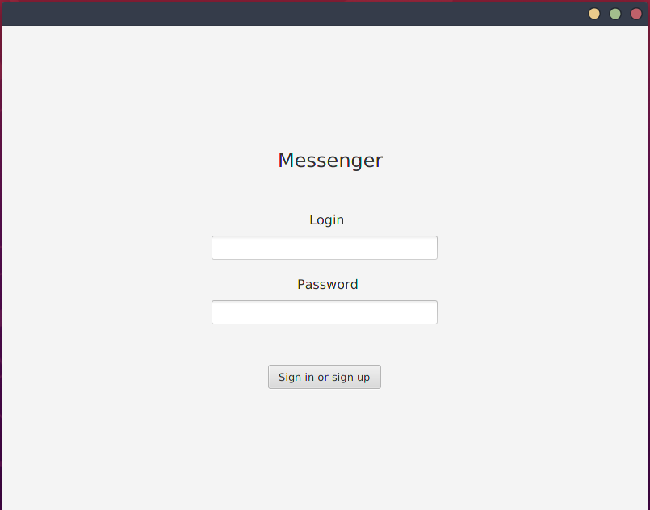
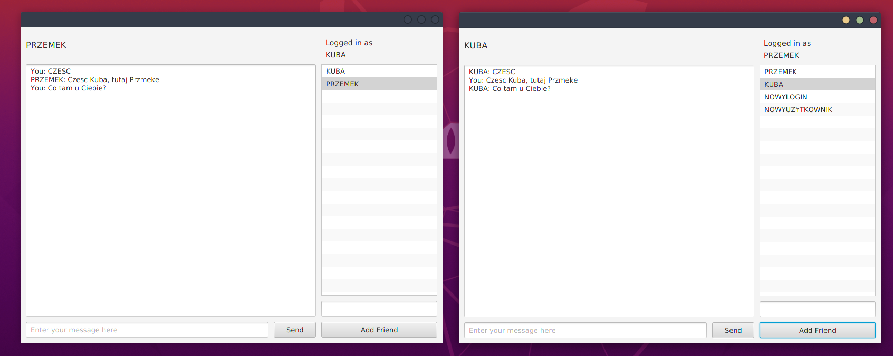

# **SK2_Messenger**

Autorzy: Przemysław Woźniak 145423, Jakub Wróbel 145188

## **Wprowadzenie**
SK_Messenger to implementacja komunikatora internetowego typu GG pozwalająca na tworzenie konta, logowanie z hasłem, dodawanie użytkowników do listy znajomych oraz prowadzenie wielu konwersacji jednocześnie.

## **Protokół komunikacyjny**
W celu komunikacji klient-serwer należało zaimplementować własny protokół komunikacyjny pozwalający przesyłać różnego rodzaju zapytania. Serwer nasłuchuje wiadomości i rozróżnia rodzaj zapytania rozpoznając pierwszy bajt odczytanej wiadomości. Protokół zawiera zakodowane człony oraz długości kolejnych członów zapisane zawsze na 4 bajtach.

### **Message protocol**
Protokół wykorzystywany do przekazywania wiadomości tekstowych w komunikatorze. Zawiera informację o długości całej wiadomości, oraz człony dotyczące nadawcy, odbiorcy i zawartości wiadomości wraz z ich długościami.


*Rys. 1 Ramka protokołu wiadomości*

### **Credentials protocol**
Protokół wykorzystywany do przekazywania informacji o logowaniu. Zawiera informację o długości całej wiadomości, oraz człony dotyczące nadawcy, odbiorcy i zawartości wiadomości wraz z ich długościami.


*Rys. 2 Ramka protokołu danych logowania*

### **Friend request protocol**
Protokół wykorzystywany do przekazywania zapytania do serwera dotyczącego istnienia użytkownika zaproszonego do znajomych. Zawiera informację o długości nazwy użytkownika, oraz nazwę użytkownika.


*Rys. 3 Ramka protokołu zaproszeń*

## **Struktura projektu**

### **Serwer**
Współbieżny serwer został zaimplementowany w języku C z wykorzystaniem API BSD sockets. Serwer ma połączenie z bazą danych sqlite3, w której przechowywane są dane zarejestrowanych użytkowników i informacje o socketach, z którymi utożsamiani są aktualnie dani użytkownicy.

### **Klient**
Aplikacja klienta została zaimplementowana w języku Java z wykorzystaniem platformy JavaFX. 

## **Uruchamianie projektu**
W celu uruchomienia projektu należy sklonować repozytorium https://github.com/wozprzemek/SK2_Messenger. Po sklonowaniu repozytorium w katalogu znajdziemy foldery server oraz client.

> ***Uwaga**: aby uruchomić projekt należy zainstalować sqlite3 oraz Maven.*

### **Serwer**
Po przejściu do folderu server kompilujemy plik server.c oraz uruchamiamy plik server przy użyciu następujących komend:

```gcc new_server.c -o server -lpthread -l sqlite3```

```./server <ip_addr> <port>```

### **Klient**
Po przejściu do folderu client za pomocą narzędzia Maven tworzymy bibliotekę .jar przy użyciu następującej komend:

```mvn clean package```

A następnie po przejściu do folderu target uruchomić aplikację poleceniem:

```java -jar messenger_client-1.0-SNAPSHOT.jar 127.0.0.1 1234```

### Screenshots
<p align="center">
  
</p>

<p align="center">
  
</p>
